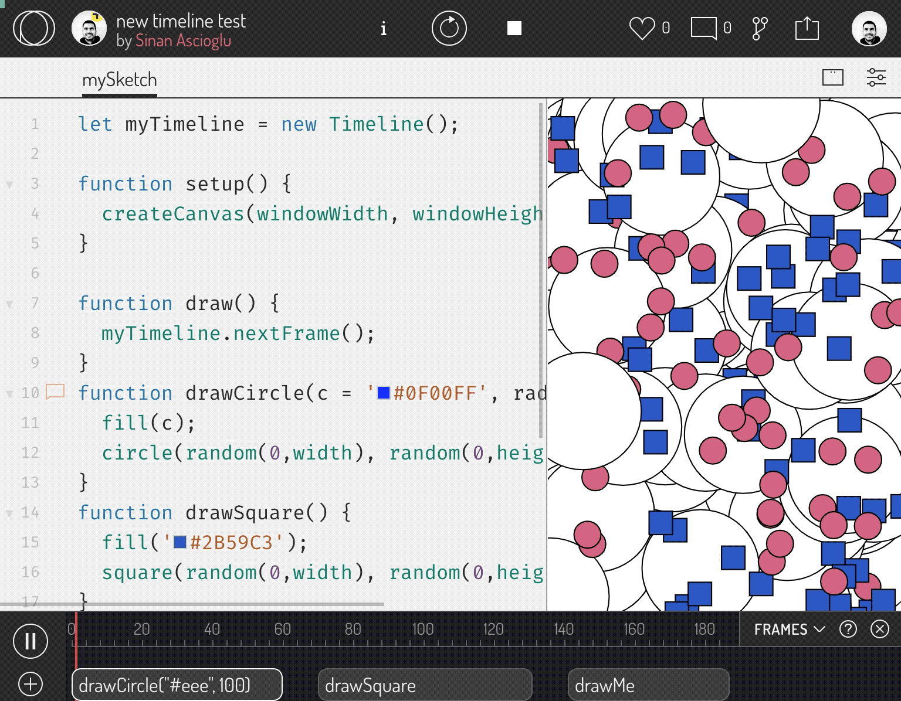

# OP-Timeline

 A timeline library that allows you to run functions on certain time or frame. It is created mainly for generative art purposes, to be used with p5js and OpenProcessing, but it can still work as a standalone library.

# Quick Start

You can create an instance of a timeline with an array of blocks (aka. functions).

```javascript
let myTimeline = new Timeline();
```

[OpenProcessing.org](https://openprocessing.org) provides a powerful and intuitive user interface to use with the timeline library. 
You can enable Timeline option on sketch settings to control your timeline with this interface. Click on (+) to select any function from the active tab to add to your timeline. You can move functions on timeline and adjust their start and end times easily. 




Few things to remember:
- `Draw` function will be set to run by default from frame 0 to 100, but it will loop, effectively running it the same way it does with p5js.
- Timeline library runs its own timer instead of using P5js timer. It stops P5js timer on load using `noLoop()` to prevent the `draw` function running when not in timeline.
- You should control the timeline in your code using the [timeline methods](#Methods) (such as `start`, `stop`, `noLoop`) instead of the p5js functions (such as `frameRate`,`loop`,`noLoop`).


## Manual Mode

You can create an instance of a timeline with an array of blocks (aka. functions). When provided, all changes in blocks (ie. start, end, etc.) should be made within code. The timeline interface on OpenProcessing will show a frozen version of the blocks provided via code.


```javascript
let myTimeline = new Timeline([{
        func: "drawCircle",
        start: 0,
        end: 100
    },
    {
        func: "drawSquare",
        start: 0,
        end: 100
    },
]);
```

## Blocks

Blocks contain the information of function name, function start time and end time.

Each **block** object consists of 3 properties. 
* "func": can be the name of a function (string) defined in the global scope (window) or directly the function itself. In string form, you can also provide arguments.
* "start" and "end": the frame numbers that the function should run during. Numbers are inclusive.
* "args": if you pass a function directly, you can also add an array of function arguments

If you would like timestamps instead of frame numbers, you can multiply frames with **estimated fps** and assign above. Note that, the frame rate may be reduced in complicated functions, causing potential inaccuracy if you use do this.

Some examples:

```javascript
function helloWorld(arg1, arg2) {
    //your code here...
}
let myTimeline = new Timeline([{
                func: "helloWorld", //call as string
                start: 0,
                end: 100
            },
            {
                func: "helloWorld('some argument','another argument')", //call it with arguments
                start: 50,
                end: 150
            },
            {
                func: () => {
                    alert("hello world")
                },
                start: 151,
                end: 200
            },
            {
                func: helloWorld, //pass function directly
                args: ['some argument', 'another argument'], //pass arguments directly
                start: 201,
                end: 300
            }
```

## Use as a Standalone Library (without p5js or OpenProcessing)

You can use this library standalone as a native javascript library to run any function.

```javascript
let myTimeline = new Timeline([{
        func: "showDialog",
        start: 0,
        end: 1
    },
    {
        func: "printToConsole",
        start: 2,
        end: 200
    },
]);

function showDialog() {
    alert('this happens first!');
}

function printToConsole() {
    console.log('this comes next');
}
```

# Methods
```javascript
myTimeline.play();
myTimeline.stop();
myTimeline.restart();
myTimeline.noLoop();
myTimeline.loop();
myTimeline.setFrameRate();
```
- **play**: proceeds frames every time `drawNextFrame` is called.
- **pause**: pauses the timeline.
- **stop**: stops the timeline and sets the current frame to 0.
- **restart**: restarts the timeline from frame 0.
- **noLoop**: prevents timeline to loop when reached at the end.
- **loop**: timeline restarts when it reaches the end. This is enabled by default. 
- **setFrameRate**: set frame rate that you want the timeline run on. Timeline will try its best to match this timeline, however any CPU intensive functions may slow down this rate. 

# Events

OP Timeline supports following events that you can listen to. You can add a listener using `on` function, and trigger them using `trigger` function.
```javascript
myTimeline.on('blockStart', function(){
	//you code here...
})
myTimeline.trigger('frameStart', function(){
	//you code here...
})
```

* **blockStart**: triggered at the start frame of a block, **before** running the block function, 
* **frameStart**: triggered at the start of any frame.
* **frameEnd**: triggered at the end of any frame.
* **start**: triggered at the start of timeline, and every time timeline loops. 
* **beforeLoop**: triggered right before timeline loops at the end.
